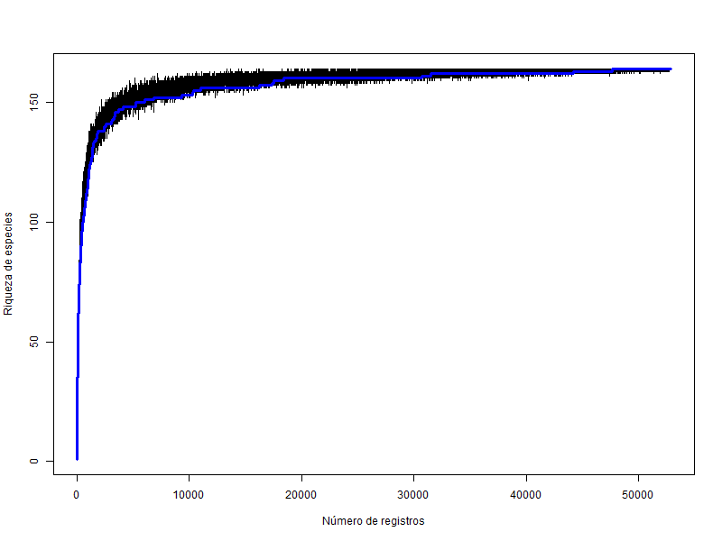
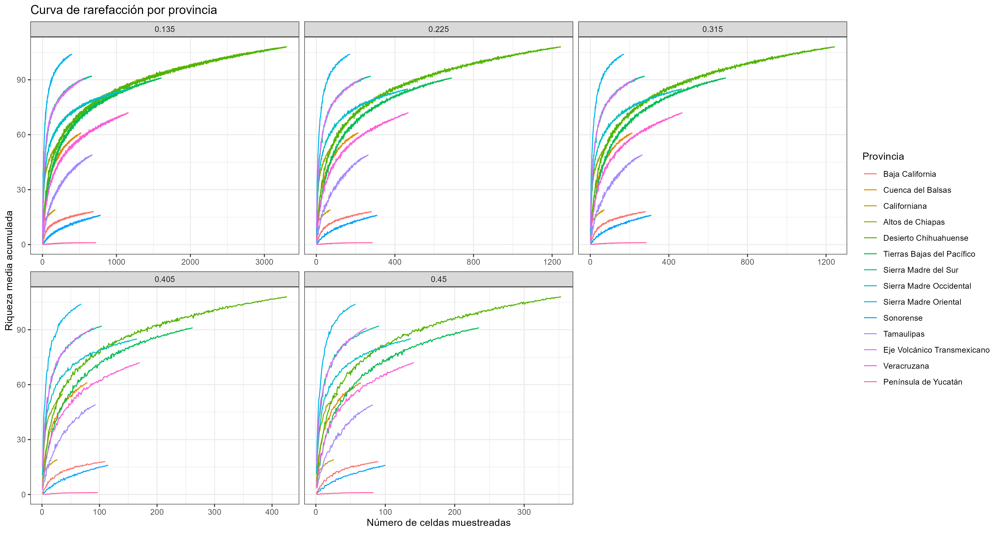
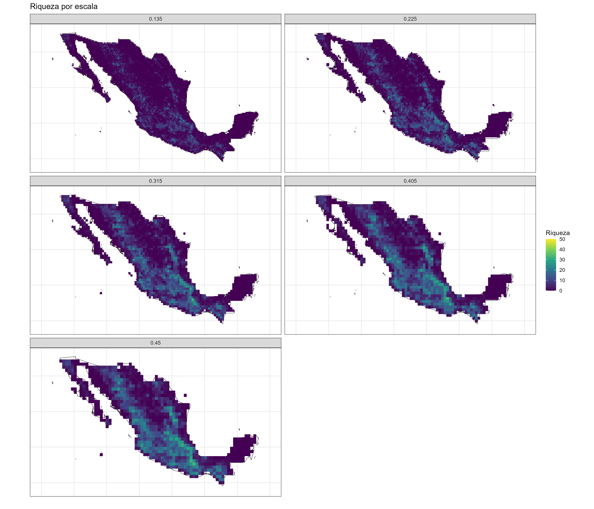
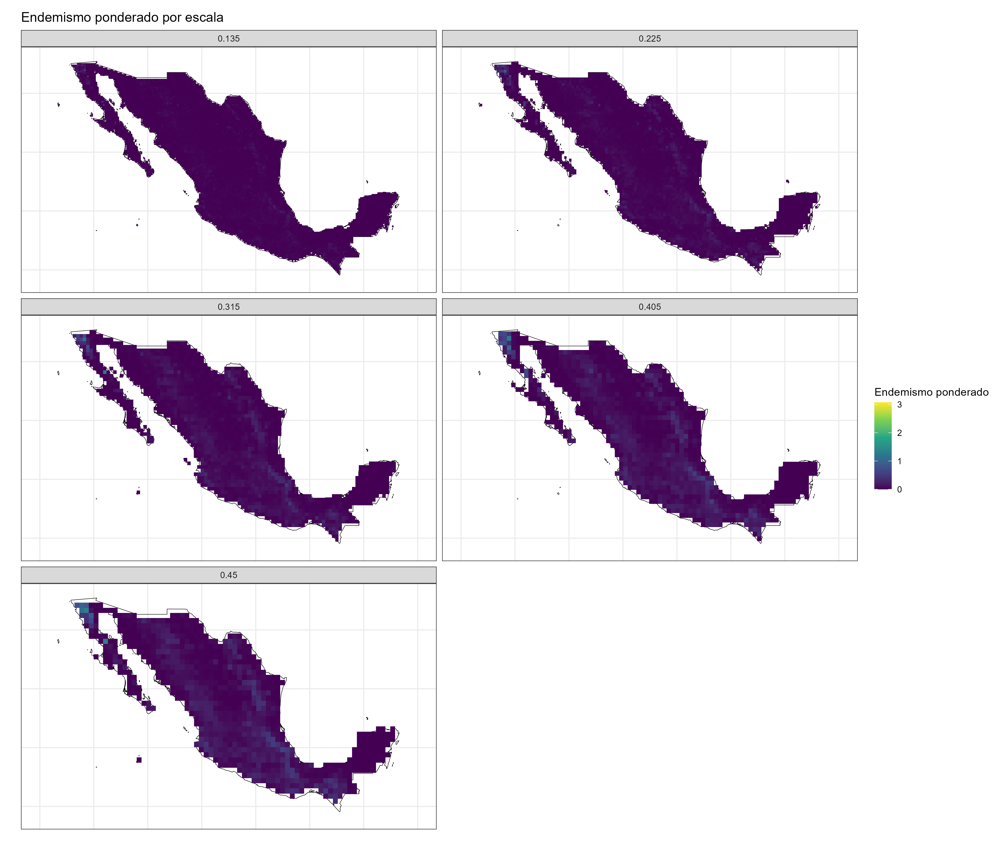
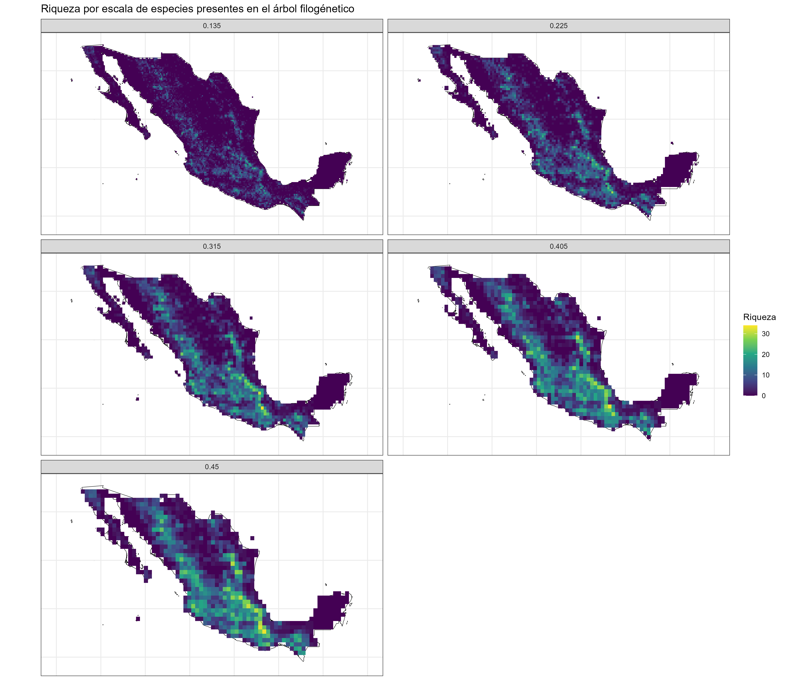
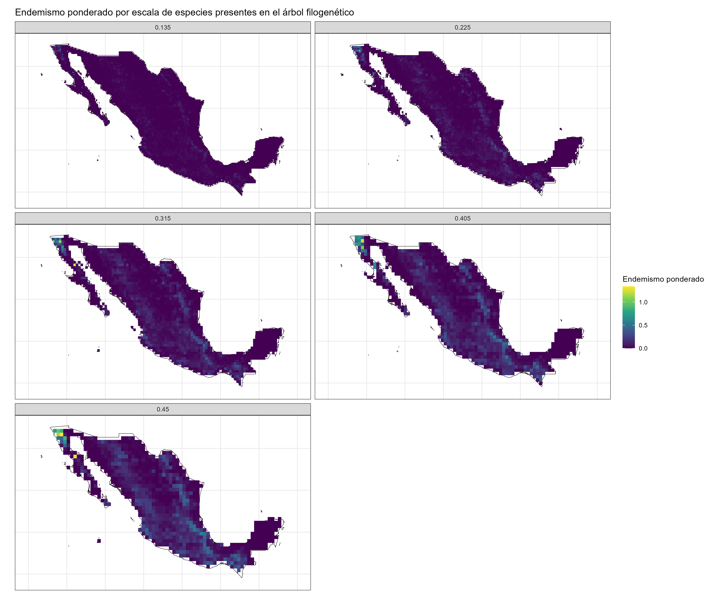

# Resultados

## Datos espaciales

```{r include=FALSE}
#| label: df_summary
library(data.table)
library(tidyverse)

data <- fread("csvs/hgbif_completo_iucn.csv")

data_summary <- data %>%
  group_by(correctname) %>%
  summarise(
    n_registros = n(),
    IUCN = unique(IUCN),
    elev_min = min(elevacion_inegi, na.rm = TRUE),
    elev_max = max(elevacion_inegi, na.rm = TRUE),
    #seccion = first(section)
  ) %>%
  ungroup() %>%
  arrange(by = n_registros)

data_summary_iucn <- data %>%
  group_by(IUCN) %>%
  summarise(
    n_registros = n(),
  ) %>%
  ungroup() %>%
  arrange(by = n_registros)

#especies en el arbol y base de datos
common <- fread("csvs/common_geo.csv")

common_summary <- common %>%
  group_by(correctname) %>%
  summarise(
    n_registros = n(),
    IUCN = unique(IUCN),
    elev_min = min(elevacion_inegi, na.rm = TRUE),
    elev_max = max(elevacion_inegi, na.rm = TRUE),
    #seccion = first(section)
  ) %>%
  ungroup() %>%
  arrange(by = n_registros)

```

La base de datos compuesta con los registros de encinos en México contiene 52,877 observaciones únicas, representando a 164 especies. 

Por otra parte, se identificaron 87 especies en común entre el árbol filogenético de Hipp et al. [-@hippGenomicLandscapeGlobal2020] y la base de datos de encinos, las cuales suman un total de 44,295 registros.

```{r}
#| label: tab-data-summary-1
#| echo: false
#| tbl-cap: Resumen de los datos espaciales
#| eval: false

knitr::kable(data_summary)
```


## Evaluación de sesgo de muestreo/escala

1. Representación de la heterogeneidad de las provincias biogeográficas por escala

En todas las escalas, las provincias biogeográficas están representadas por más de una celda. En el caso de las regiones con un área menor, como los Altos de Chiapas o la Sonorense, el número de celdas se mantiene relativamente constante a partir de una resolución cercana a 0.315°.

Por el contrario, en las provincias más extensas y con mayor número de registros, como la de Sierra Madre Oriental o el Desierto Chihuahuense, se observan diferencias más marcadas entre escalas, aunque en resoluciones de 0.405° y 0.45° los patrones de representación son bastante similares.

::: {layout-ncol="2"}


:::
: @fig-cuadrosRegion *Conteo de píxeles por provincia biogeográfica.* La imagen izquierda presenta el número total de píxeles en cada provincia, sin considerar si contienen registros o no, mientras que la imagen derecha muestra únicamente los píxeles que contienen registros de especies.


2. Relación registros vs riqueza


La curva de acumulación de riqueza de especies mostró una asintota con respecto al número de registros, aproximadamente desde 5000 registros (@fig-accumrichness). Lo que sugiere que la estimación de la riqueza de especies no depende del orden de los registros, lo cual refuerza su validez.


{#fig-accumrichness}


3. Curvas de rarefacción

{#fig-accum}

## Índices de biodiversidad 

1. Riqueza

Desde las escalas más finas (0.135° y 0.225°), se observa la presencia de áreas con alta riqueza en la Sierra Madre Oriental (SOr), el Eje Volcánico Transmexicano (EVT) y la Sierra Madre del Sur (SMS). Este mismo patrón se observa en escalas más gruesas (0.315°, 0.405° y 0.45°), pero no se observan diferencias significativas entre ellas. 

{#fig-rich}


2. Endemismo ponderado 

En las escalas más finas (0.135° y 0.225°), no se distingue la presencia de zonas con valores medios o altos. A partir de la escala de 0.315°, comienzan a identificarse áreas con valores relativamente elevados, especialmente en la provincia Californiana, así como en regiones de Baja California y del EVT. Este patrón se vuelve más evidente conforme se incrementa el tamaño de celda, siendo más claro en las escalas más gruesas (0.405° y 0.45°), siendo estas ultimas relativamente similares.


{#fig-we}

3. Diversidad filogénetica

A una escala muy fina (0.135°), los patrones de diversidad filogenética no son evidentes. Estos comienzan a delinearse a partir de la escala de 0.225°, pero es en la escala de 0.315° donde se aprecian con mayor claridad. En esta última, se destacan por sus altos valores de diversidad filogenética la Sierra Madre Occidental (SOcc), la Sierra Madre del Sur (SMS), la Sierra Madre Oriental (SMOr) y el Eje Volcánico Transmexicano (EVT).


{#fig-pd}


4.Riqueza de especies de las especies compartidas entre la base de datos y el árbol filogénetico

En este caso, a partir de la escala de 0.225°, se distinguen con mayor claridad las celdas con mayor riqueza en comparación con aquellas que no la presentan. A partir de la escala de 0.315°, se observa que los valores más altos se concentran en sitios dentro de la SMS, la SMOr y el EVT. En las escalas más gruesas (0.405° y 0.45°), el patrón se mantiene sin cambios significativos respecto a lo observado previamente.

Cabe destacar que, al considerar únicamente las especies incluidas en el árbol filogenético, los patrones de alta riqueza se vuelven aún más evidentes, especialmente en el EVT y la SMS.


{#fig-richTree}


5. Endemismo ponderado de las especies compartidas entre la base de datos y el árbol filogénetico

Al igual que en el endemismo ponderado tomando en cuenta todas las especies, las escalas más finas (0.135° y 0.225°), no proporcionan información sobre posibles sitios con valores altos de endemismo ponderado. Es a partir de la escala de 0.315° donde la provincia Californiana y la de Baja California muestran valores elevados. Por otra parte, no se observan patrones distintos en las escalas de 0.315°, 0.405° y 0.45°.


{#fig-weTree}


